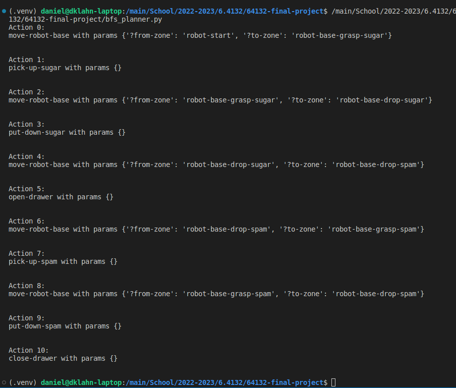

# 64132-final-project
## Introduction

Robots are becoming more prevalent in the world, ranging from industrial robots, Mars rovers, to underwater explorers. Thus, many robots are in enviroments where humans cannot fully predict or visit while the robot is operating. This complication leads to the need for automating tasks that the robot can carry out without supervision or control from a human.

An autonomous robot needs to achieve three objectives:
 * Be able to schedule tasks such that it can complete a goal
 * Be able to implement the tasks while avoiding obstacles
 * Optimize its movement for maximum efficency

## Activity Planning

### What's where

 * problem.pddl: PDDL problem definition
 * domain.pddl: PDDL domain definition
 * bfs_planner.py: BFS planner for high level activity planning

### Explanation

To break down the problem into managable parts, we first have some assumptions:
* The robot is given the locations of the sugar box, spam box, and the goal.
* There will always be a sugar box, a spam box, goal zones, and a robot.
* The robot's sensors are accurate, meaning that the action that it is told to perform will be completed 100% of the time.
* The motion of the robot can be abstracted away in the activity plan, and the lower level motion planning will be solved separately

We define a set of objects (e.g. the robot base, robot arm, sugar box, spam) that can be in a set of predefined positions in the world which we call "zones". We formulated most of our predicates, preconditions, and actions around the idea the objects are either within a zone or not. We use this idea to define our initial state and goal states in terms of the positions of the spam and sugar. We can also use this framework to define many of the preconditions for our actions (e.g. the robot base must be in a zone near the counter in order to pick up the sugar). We also defined a predicate for keeping track of the gripper state (gripper empty/not empty) and whether certain zones were accessible (e.g. the spam drop location could be inaccessible if the drawer is closed).

We defined the following actions:
 - move-robot-base
 - pick-up-sugar
 - put-down-sugar
 - open-drawer
 - pick-up-spam
 - put-down-spam
 - close-drawer

These actions are fairly high level and required us to implement them as a set of sub-actions. We attempted to formulate our domain file as a set of more granular steps and our constraints in terms of distance between objects, but this required more advanced features of PDDL that we decided to not use for our first iteration.

Below is a printout of the plan generated by our activity planner as a list of actions and their parameters:

## Sample Based Motion Planning

### What's where

 * robot_commands.py: implementations of our actions from the BFS planner and integration with the pybullet simulation
 * rrt.py: implementation of the RRT algorithm for arm motion planning
 * simulation.py: our simulation environment and execution engine

### Executing the Plan

https://user-images.githubusercontent.com/13775518/207674659-7e2b6d00-af5a-497d-b187-f245087b2a9b.mp4

In the video, we show the robot executing the first few steps of the generated plan:

 - Move the base to a position to grasp the sugar
 - Move the arm to a position to grasp the sugar
 - Move the arm back to the home position while "grasping" the sugar

In the video we can see the robot base moving to the counter in preparation of grasping the sugar. The colorful robot clone that is shown is a visualization of the RRT motion planner and inverse kinematic solver finding a valid path to the sugar grasp position. Our robot doesn't actually pick up the sugar in the simulation, but it prints "GRASPED SUGAR" in the debugging window. If we were to implement grasping, we would probably do it by welding the box to the gripper once they were close enough together. Once the sugar box is "grasped", we can see the arm use RRT and the inverse kinematic solver (visualized with colorful link rendering) navigate the arm back to the home position.

Our activity planner generates the rest of the plan, but our RRT gets stuck after executing the first two steps and is not able to execute it.

### Explanation

Our BFS planner from part 1 returns a list of actions to take along with some action parameters (if applicable). We created an execution engine that maps the action names to functions that implement the actions by commanding robot motion in the simulation. We hardcode the positions of interest (e.g. the robot base position next to the counter and arm grasping poses) in a dictionary. Some actions are broken down into sub-actions in their implementation functions. For example, the pick-up-sugar action executes the sub-actions: moves the arm to the sugar grasp pose, "grasps" the sugar by printing to the debug console, moves the arm back to the home position.

We use two approaches to motion planning for this project:

For the robot base, we assume that the floor is clear of obstacles and that the possible locations the base might navigate to are free of collisions. Using this assumption, our robot base can simply rotate and move in straight lines between points on the floor.

Moving the robot arm is more complicated because there are obstacles that could be in the way and we must take into account the limitations of the arm joints. We decided to use RRT and the pybullet inverse kinematic solver to plan motion for the arm. Our first implementation of RRT generated a path as a list of points in 3D space. While this generated a valid path that avoided obstacles, it didn't work because the inverse kinematic solver sometimes could not find a way to move the arm between adjacent points. The solution to this was to reimplement RRT so that it returned a path as a list of points through the joint space. This ensured that the inverse kinematic solver could find a solution to moving the arm between adjacent points in the path.

## Trajectory Optimization

### What's where

 * trajectory_optimization.py: Implementation of trajectory optimization, specifically the `trajectory_optimization` function

### Explanation

First, we decide on a way to optimizing the path. In this case, we decide to optimize the distance travelled by the gripper from a start position to an end position, as the less distance the gripper travels, the less time it would take to get from the start position to the end position.

As such, the cost function of the optimization is the path length of the gripper's path. The goal is to minimize the total distance.

$$\min_{q_k,\\ k \in {0, 1, ... N}}\quad \sum_{j=0}^{N-1} | q_{j+1}- q_j|_2^2$$

where

$$ q_0 = q_{start}$$

$$ q_N =q_{goal} $$

$$\text{no collision}(q_n) \in [0.9, 1.1] \\ \forall n$$

, and the robot joint constraints are the constraints.

The constraints for the trajectory optimization is by checking if a position collides with any other objects in the world, and would return a 1 if there is no collision, and 0 if there is a collision. This is then turned into a constraint where the constraint function value is between [0.9, 1.1] in order to be valid.

The decision variables that are being solved for are the configuration angles of the robot arm joints along the path.

Using the Solve function in pyDrake, one can get an optimized path.

https://user-images.githubusercontent.com/100317617/206828805-700ff410-19e4-4689-acf6-0063a8a2b874.mp4

In the video, the blue line is the path of the sample based motion planner (RRT), while the green line is the one produced by the trajectory optimization.

The trajectory optimization chooses the path with the shortest distance, but takes longer to compute than RRT.

## Conclusion

